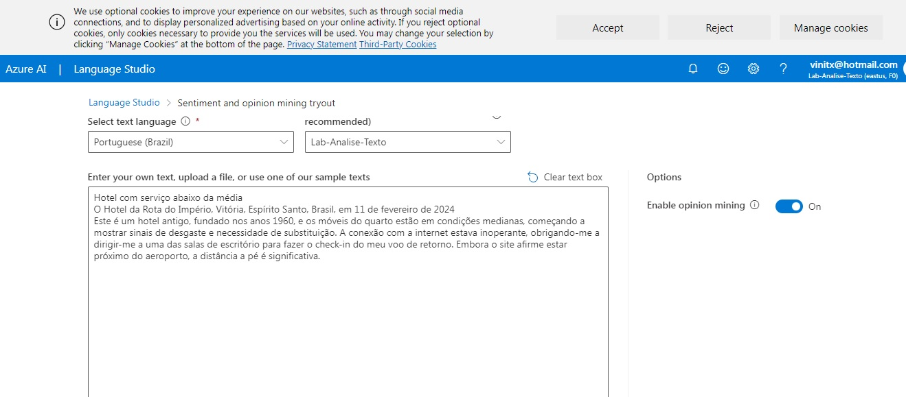
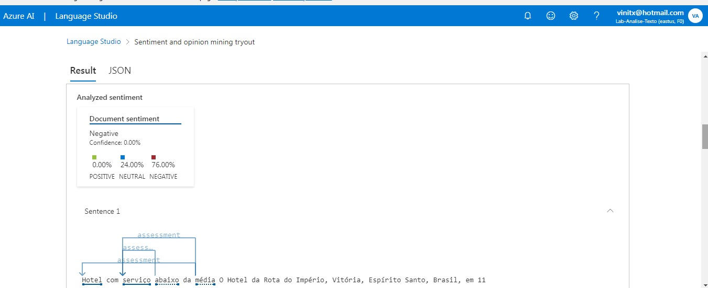
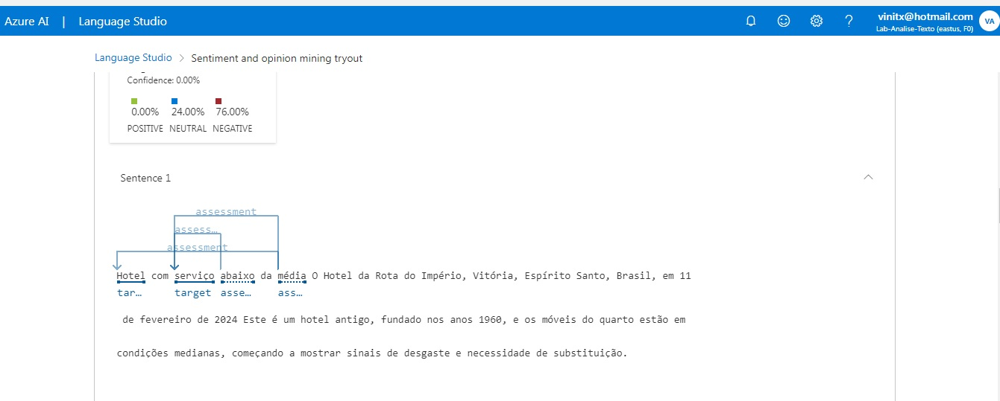
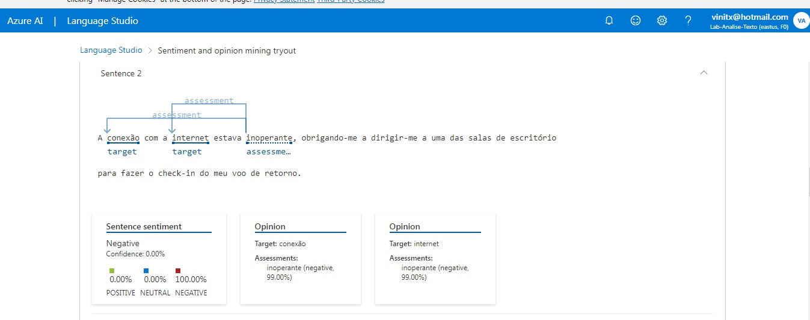
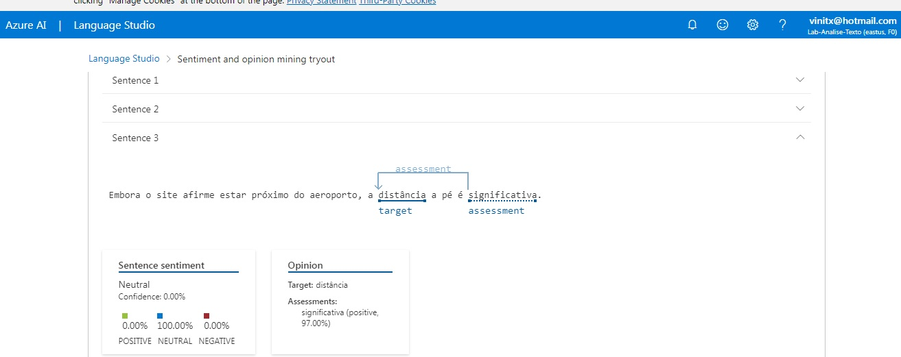
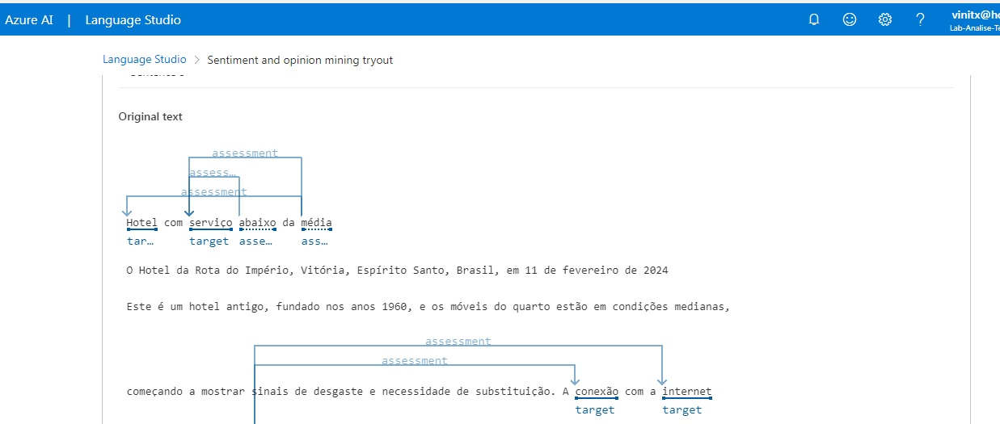
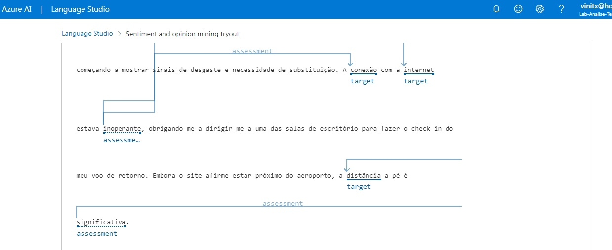

# Laboratório Analise texto com Language Studio

## Resumo

Projeto com Language Studio da Azure analisando um exemplo de avaliação de hotel para entender se as avaliações são em sua maioria positivas ou negativas, como desafio de projeto da DIO.

## Processo

1. **Configuração**: Criação de um recurso de idioma no [Portal Azure](https://portal.azure.com)
2. **Configuração do recurso**: Configuração do recurso no [Azure AI Language Studio](https://language.cognitive.azure.com)
3. **Review no Language Studio**: Uso do Language Studio, para Analisar sentimento e extrair opiniões. A sentença está localizada na pasta **inputs** com o nome **sentenca.txt**.

Abaixo o print da utilização do recurso de review do Hotel de exemplo no Language Studio 

4. **Análise da avaliação do Review**: Análise da avaliação do Review. As imagens abaixo estão na pasta **outputs** do projeto.
- Setença 01
    - 
    - 

- Setença 02
    - 

- Setença 03
    - 

- Texto Completo
    - 
    - 

## Insights Principais

- A análise de sentimentos pode ajudar as empresas a entender melhor as percepções dos clientes sobre seus produtos ou serviços